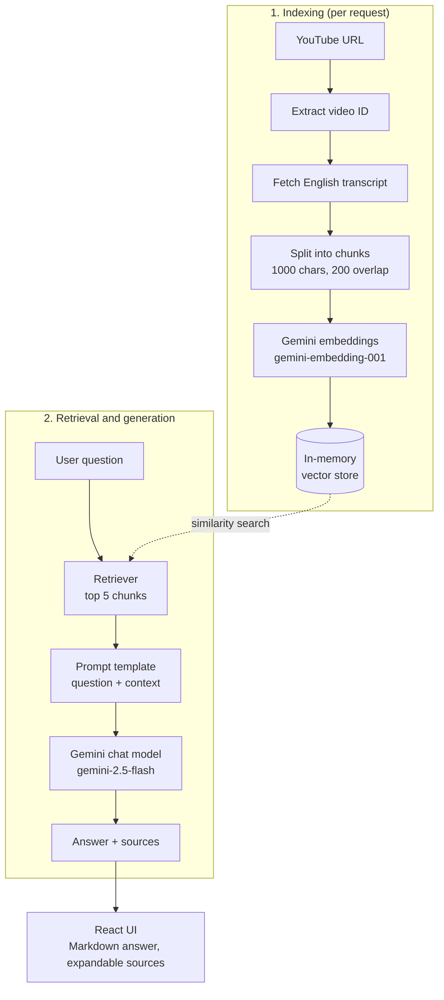

# 🎬 YouTube Chatbot

Ask questions about any YouTube video and get answers grounded in its transcript. Paste a link, ask a question, and skip watching the whole video.

## What it does

- Takes a YouTube URL and a question
- Fetches the English transcript (`en`, `en-US` or `en-GB`)
- Finds the most relevant transcript passages using semantic search
- Uses Google Gemini to answer **only from those passages**, and shows the sources

## Why it matters

- **Saves time:** get the answer from a long video in seconds
- **Grounded answers:** the model is told to use only the transcript and to say so when the answer isn't there, which reduces hallucination
- **Transparent:** every answer comes with the source passages it was based on

## Architecture (RAG)



## Tech stack

| Layer | Tools |
| --- | --- |
| Frontend | React, TypeScript, Vite, react-markdown |
| Backend | NestJS, TypeScript, class-validator |
| RAG | LangChain.js, `MemoryVectorStore` |
| Models | Google Gemini (chat + embeddings) |
| Transcripts | `youtube-transcript` |

## Project structure

```text
youtube-chatBot/
├── backend/    # NestJS API + LangChain pipeline (questions/, health/)
├── frontend/   # React UI (question form, answer display)
└── package.json  # npm workspaces
```

## Getting started

**Requirements:** Node.js 20+, npm, and a Google Gemini API key.

1. Create `backend/.env`:

   ```dotenv
   GOOGLE_API_KEY=your-google-api-key
   GOOGLE_CHAT_MODEL=gemini-2.5-flash
   GOOGLE_EMBEDDING_MODEL=gemini-embedding-001
   PORT=3000
   ```

2. Install and run from the repository root:

   ```bash
   npm install
   npm run dev
   ```

- Frontend: <http://localhost:5173>
- Backend: <http://localhost:3000>

## API

**`POST /api/questions`**

```json
{
  "videoUrl": "https://www.youtube.com/watch?v=dQw4w9WgXcQ",
  "question": "What is this video about?"
}
```

Response:

```json
{
  "status": "answered",
  "videoId": "dQw4w9WgXcQ",
  "question": "What is this video about?",
  "answer": "The video is about ...",
  "sources": ["A relevant transcript passage..."]
}
```

**`GET /api/health`** returns `{ "status": "ok", "timestamp": "..." }`.

Supported links: watch, `youtu.be`, embed, Shorts and live URLs.

## Limitations

- Works only for videos with English captions (manual or auto-generated); no translation
- The vector store is in-memory and rebuilt on every request, so the transcript is re-fetched and re-embedded each time

## Build

```bash
npm run build           # builds backend/dist and frontend/dist
npm run start:backend   # run the compiled backend
```
